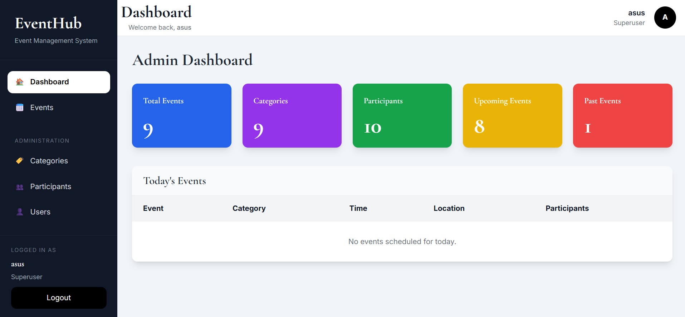
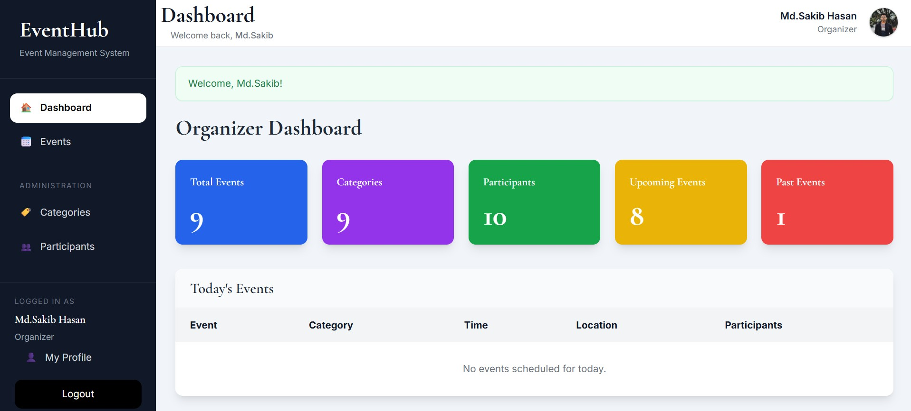
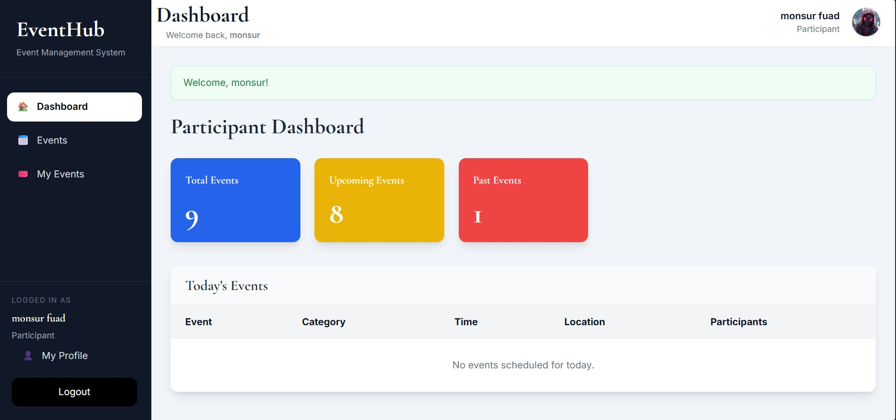
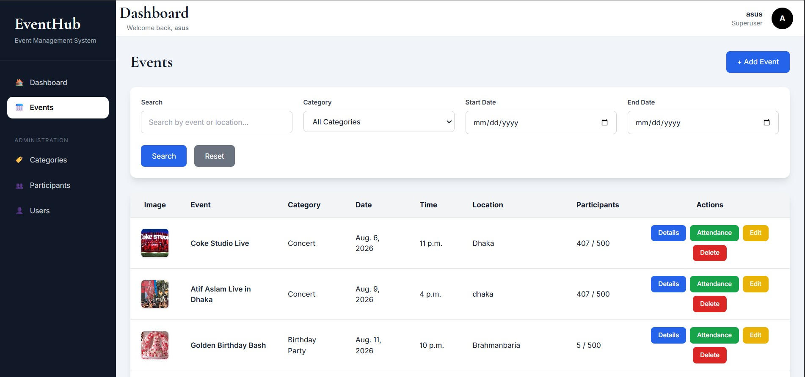
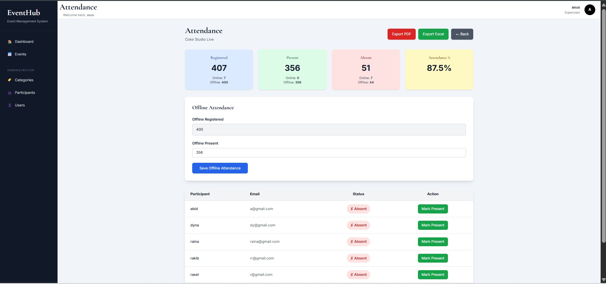
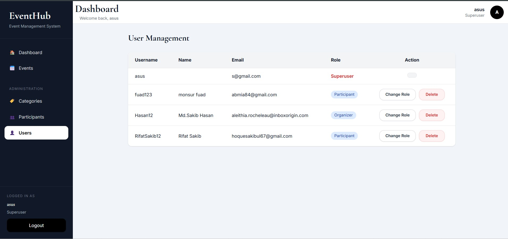
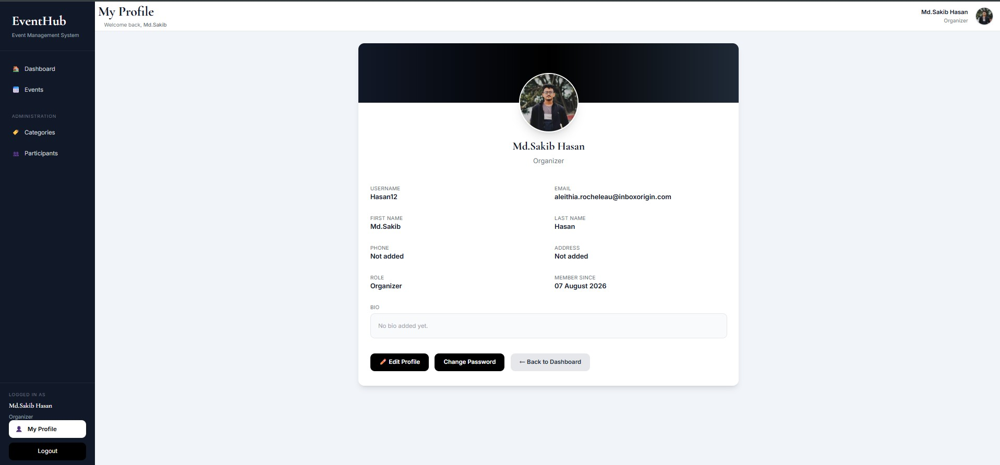
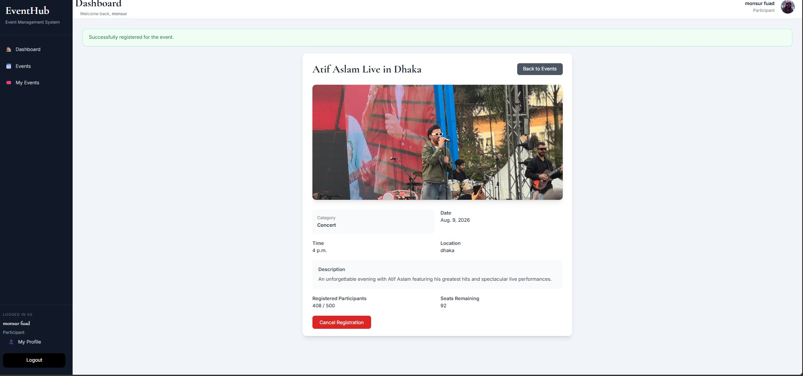
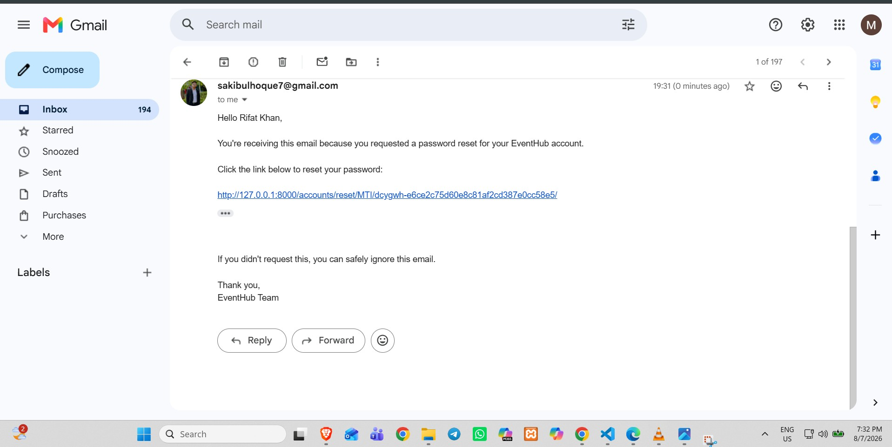
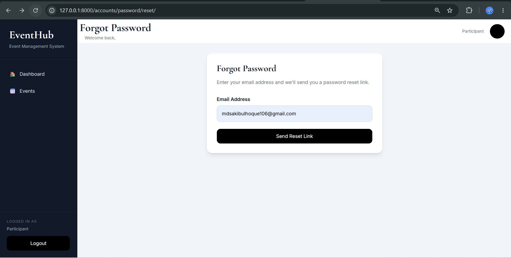

# EventHub - Event Management System

A modern Event Management System built with Django, PostgreSQL, and Tailwind CSS. EventHub provides a secure role-based platform for administrators, organizers, and participants to manage events, registrations, attendance, user profiles, and reports.

---

## Overview

EventHub simplifies the process of organizing and managing events through a secure web application. It supports three user roles with different permissions and includes event registration, attendance management, profile management, PDF and Excel exports, and responsive user interfaces.

---

## Features

### Authentication

- User Registration
- Email Verification
- Login and Logout
- Forgot Password
- Password Reset via Email
- Change Password
- Password Validation
- Profile Management
- Profile Picture Upload

---

### Role-Based Access Control

#### Administrator

- Dashboard
- Manage Users
- Assign User Roles
- Delete Users
- Manage Events
- Manage Categories
- Manage Participants
- Manage Attendance

#### Organizer

- Dashboard
- Create Events
- Edit Events
- Delete Events
- Manage Categories
- Manage Participants
- Manage Attendance

#### Participant

- Dashboard
- Register for Events
- Cancel Event Registration
- View Registered Events
- Update Profile
- Upload Profile Picture
- Change Password

---

## Event Management

- Create Events
- Edit Events
- Delete Events
- Event Image Upload
- Event Capacity Management
- Offline Participant Registration
- Automatic Registration Closing
- Registration Status
- Event Details

---

## Category Management

- Create Categories
- Edit Categories
- Delete Categories

---

## Participant Management

- Add Participants
- Edit Participants
- Delete Participants
- Upload Profile Images
- Manage Contact Information

---

## Attendance Management

- Mark Online Attendance
- Offline Attendance Management
- Attendance Statistics
- Attendance Percentage
- Export Attendance as PDF
- Export Attendance as Excel

---

## Dashboard

Dashboard includes:

- Total Events
- Total Categories
- Total Participants
- Upcoming Events
- Past Events
- Today's Events

---

## Search and Filtering

- Search Events
- Search by Location
- Filter by Category
- Filter by Date Range
- Pagination

---

## Responsive Design

- Desktop Friendly
- Tablet Friendly
- Mobile Responsive
- Tailwind CSS Interface

---

## Technology Stack

### Backend

- Python 3
- Django 6

### Database

- PostgreSQL

### Frontend

- HTML5
- Tailwind CSS
- JavaScript

### Libraries

- Pillow
- ReportLab
- OpenPyXL
- WhiteNoise
- python-dotenv

---

## Installation

### Clone the Repository

```bash
git clone https://github.com/YOUR_USERNAME/EventManagementSystem.git

cd EventManagementSystem
```

---

### Create a Virtual Environment

#### Windows

```bash
python -m venv venv

venv\Scripts\activate
```

#### Linux/macOS

```bash
python3 -m venv venv

source venv/bin/activate
```

---

### Install Dependencies

```bash
pip install -r requirements.txt
```

---

### Configure Environment Variables

Create a `.env` file in the project root.

```env
SECRET_KEY=your-secret-key

DEBUG=True

ALLOWED_HOSTS=127.0.0.1,localhost

DB_NAME=event_management_db
DB_USER=postgres
DB_PASSWORD=your_database_password
DB_HOST=localhost
DB_PORT=5433

EMAIL_HOST_USER=your_email@gmail.com
EMAIL_HOST_PASSWORD=your_app_password
```

---

### Apply Database Migrations

```bash
python manage.py makemigrations

python manage.py migrate
```

---

### Create a Superuser

```bash
python manage.py createsuperuser
```

---

### Run the Development Server

```bash
python manage.py runserver
```

Open:

```
http://127.0.0.1:8000/
```

---

## Project Structure

```
EventManagementSystem/
│
├── accounts/
├── config/
├── dashboard/
├── events/
├── media/
├── screenshots/
├── static/
├── templates/
│
├── .env
├── .gitignore
├── manage.py
├── requirements.txt
├── package.json
├── tailwind.config.js
└── README.md
```

---

## User Permissions

| Feature | Administrator | Organizer | Participant |
|----------|:-------------:|:---------:|:-----------:|
| Dashboard | Yes | Yes | Yes |
| Event Management | Yes | Yes | Register/View |
| Category Management | Yes | Yes | No |
| Participant Management | Yes | Yes | No |
| Attendance Management | Yes | Yes | No |
| User Management | Yes | No | No |
| Assign Roles | Yes | No | No |
| Delete Users | Yes | No | No |
| Profile Management | Yes | Yes | Yes |
| Change Password | Yes | Yes | Yes |

---

## Screenshots

### Login


### Admin Dashboard



### Organizer Dashboard



### Participant Dashboard



### Events



### Attendance



### Users



### Profile



### Create Account


### Registration Confirmation



### Password Reset Email



### Password Reset



---

## Future Improvements

- QR Code Check-in
- Email Notifications
- Calendar Integration
- Event Analytics Dashboard
- REST API
- Mobile Application
- Dark Mode
- Multi-language Support

---

## License

This project was developed for academic and educational purposes.

---

## Author

**Md. Sakibul Hoque**

Department of Computer Science and Engineering

American International University-Bangladesh (AIUB)

GitHub: https://github.com/Sakibul786